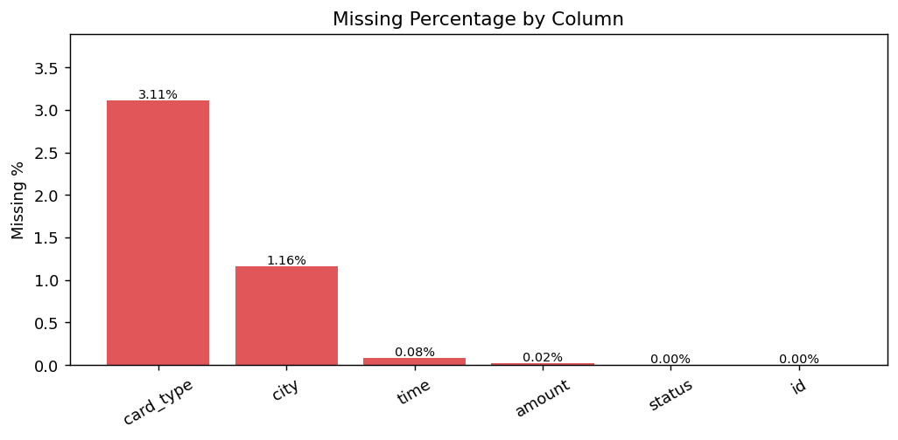
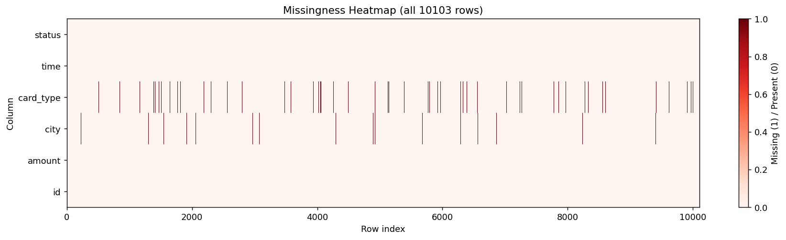
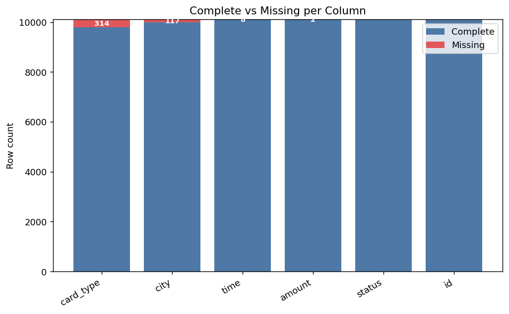
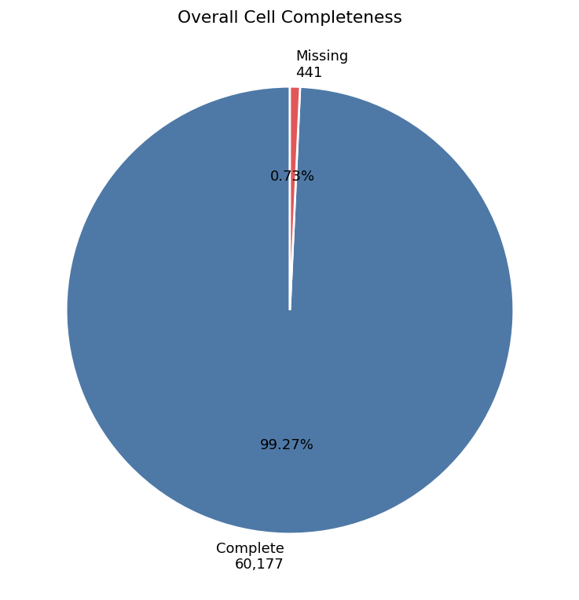
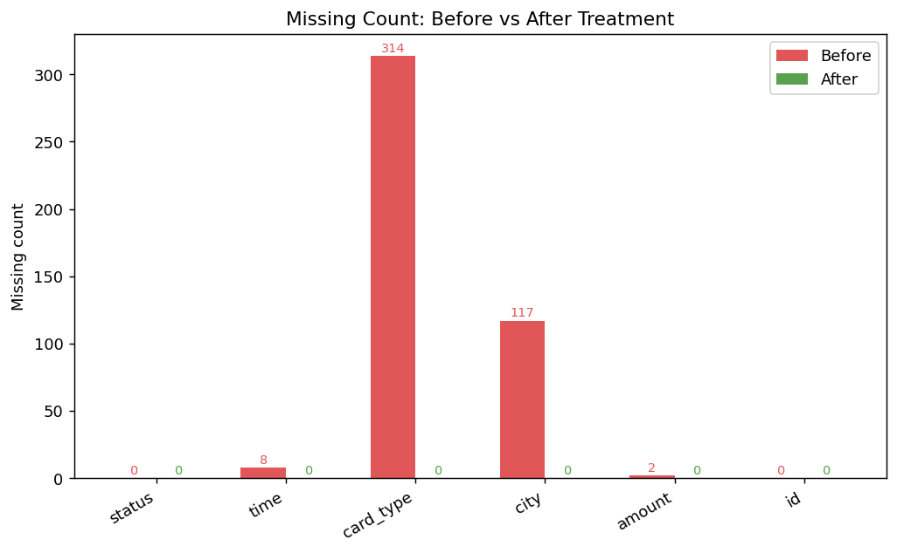
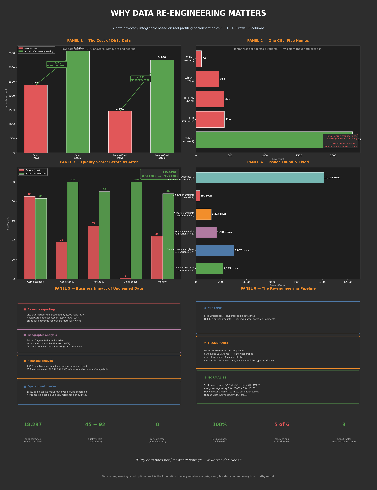

# Data Re-engineering

This project profiles, cleans, normalises, and documents two imperfect datasets as part of a data re-engineering assignment. The work covers data value awareness, practical profiling, re-engineering execution, validation, ethics, and advocacy (sections 2.1 – 2.5).

---

## Datasets

| File | Rows | Description |
|---|---:|---|
| `calorie_efficiency_dataset.csv` | 1,000,000 | Synthetic fitness/health metrics with a calorie-efficiency outcome label |
| `retail_store_sales.csv` | 12,575 | Retail transaction log with product, price, quantity, customer and discount fields |
| `uncleaned bike sales data.csv` | — | Bike sales data explored in `bike-sales-data.ipynb` |

---

## How to Run

```bash
# Activate the virtual environment
source .venv/bin/activate

# Calorie efficiency pipeline (full dataset)
python calorie_efficiency_reengineering.py

# Retail store sales pipeline
python retail_store_sales_reengineering.py

# Optional flags (both scripts)
--sample-rows N        # Process only the first N rows (faster iteration)
--no-write-datasets    # Skip writing cleaned/normalised CSVs (report + infographic only)
--output-dir PATH      # Custom output directory (default: out_<dataset>/)
```

---

## What Was Done

### Calorie Efficiency Dataset

**Quality issues found:**

| Issue | Detail |
|---|---|
| Constant column | `calories_burned` = 1,500 for all 1,000,000 rows — a data-generation placeholder |
| Unit inconsistency | `body_fat_percentage` and `muscle_mass_ratio` stored as fractions (0–1) despite their names implying percentages |
| Mixed scale | `efficiency_score`: 244,137 records (24.4%) were on a 0–10 scale; the rest were on 0–1 |
| Inconsistent labels | `calorie_efficiency` used verbose mixed-case forms: `Low Efficiency`, `High Efficiency`, `Moderate` |
| Class imbalance | ~93.8% of records labelled `Low Efficiency` — relevant for any downstream modelling |

**Re-engineering actions:**

- Renamed all columns to `snake_case`
- Standardised `calorie_efficiency` labels → `low` / `moderate` / `high`
- Converted `body_fat_percentage` (fraction → `body_fat_pct`, ×100) and `muscle_mass_ratio` (fraction → `muscle_mass_pct`, ×100)
- Normalised `efficiency_score`: values > 1 divided by 10, standardising all records to a 0–1 scale (244,137 records rescaled)
- Rounded heart-rate fields to integer BPM
- Dropped the constant `calories_burned` column (value preserved in `metadata.json`)
- Added `record_id` surrogate key
- Normalised wide table into three relational tables keyed by `record_id`: `demographics.csv`, `activity.csv`, `outcomes.csv`

---

### Retail Store Sales Dataset

**Quality issues found:**

| Column | Missing | Notes |
|---|---:|---|
| `Discount Applied` | 4,199 (33.4%) | Unknown — not imputed to avoid bias |
| `Item` | 1,213 (9.6%) | Inferrable from `(Category, Price Per Unit)` rule |
| `Price Per Unit` | 609 (4.8%) | Reconstructable from `Total Spent ÷ Quantity` |
| `Quantity` | 604 (4.8%) | 609 records had Item, Price, Qty, and Total all missing together (structured missingness — likely a POS capture failure) |
| `Total Spent` | 604 (4.8%) | Reconstructable from `Price × Quantity` |

**Re-engineering actions:**

- Renamed all columns to `snake_case`
- Parsed `transaction_date` to datetime; added `transaction_date_iso` (YYYY-MM-DD) for stable exports and `transaction_year` / `transaction_month` for analytics
- Normalised `Discount Applied` to nullable boolean (`True` / `False` / `<NA>`): missing values **not** imputed — unknown ≠ False
- Reconstructed 609 missing `price_per_unit` values from `total_spent ÷ quantity`, rounded to nearest 0.50 (observed price granularity)
- Inferred all 1,213 missing `Item` values using the verified rule that each `(Category, Price Per Unit)` pair maps to exactly one item — 100% resolved
- Imputed 604 missing `quantity` values using a mode hierarchy: per-item mode → per-category mode → global mode (= 10)
- Reconstructed 604 missing `total_spent` values from `price_per_unit × quantity`
- Added `row_id` surrogate key
- Normalised wide table into a star schema: `fact_sales.csv` + 5 dimension tables (`dim_customer`, `dim_category`, `dim_item`, `dim_payment_method`, `dim_location`)

---

## Outputs

Each pipeline writes to its own output directory:

```
out_calorie_efficiency/
├── calorie_efficiency_reengineering_report.md   # Full assignment report (sections 2.1–2.5)
├── advocacy_infographic.png                      # 4-panel advocacy visual
├── metadata.json                                 # Audit log of every transformation
├── calorie_efficiency_cleaned_wide.csv           # Cleaned flat file
├── demographics.csv                              # Normalised: age, BMI, body composition
├── activity.csv                                  # Normalised: steps, sleep, workouts, heart rate
└── outcomes.csv                                  # Normalised: efficiency_score, calorie_efficiency

out_retail_store_sales/
├── retail_store_sales_reengineering_report.md   # Full assignment report (sections 2.1–2.5)
├── advocacy_infographic.png                      # 4-panel advocacy visual
├── metadata.json                                 # Audit log of every transformation
├── retail_store_sales_cleaned_wide.csv           # Cleaned flat file
├── fact_sales.csv                                # Transaction fact table
├── dim_customer.csv
├── dim_category.csv
├── dim_item.csv
├── dim_payment_method.csv
└── dim_location.csv
```

All transformation decisions (rename maps, imputation strategies, counts, constants dropped) are recorded in `metadata.json` so every change is traceable and reversible.

---

## Notebooks

`bike-sales-data.ipynb` — exploratory analysis of the bike sales dataset covering date parsing and consistency checks, missing value imputation, month name standardisation, and age group validation.

---

## Transaction Dataset — Data Profiling & Re-engineering

**File:** `transaction.csv` | **Rows:** 10,103 | **Columns:** 6 (`id`, `status`, `time`, `card_type`, `city`, `amount`)

---

### Completeness Analysis











---

### Consistency Analysis

See [consistency-analysis.md](reports/consistency-analysis.md) for the full report covering all 6 columns, evidence tables, charts, and re-engineering justification.

---

### Re-engineering Execution Report

See [reengineering-report.md](reports/reengineering-report.md) for the full execution report covering all three phases (cleansing, transformation, normalisation), before/after comparisons, and justification for every decision.

### Advocacy & Professional Reflection

See [advocacy-reflection.md](reports/advocacy-reflection.md) for the full advocacy artefact and professional reflection.

The infographic below summarises the case for data re-engineering in six evidence-based panels:



---

### Validation, Ethics & Quality Review

| Report | Description |
|--------|-------------|
| [validation-report.md](reports/validation-report.md) | Quantitative before/after comparison across completeness, consistency, accuracy, structural integrity, and row preservation |
| [ethics-report.md](reports/ethics-report.md) | Reflection on privacy risks, geographic and statistical bias, fairness implications, and ethical responsibilities of the data re-engineer |
| [quality-review-report.md](reports/quality-review-report.md) | Column-level quality scoring (0–100), overall quality scorecard (45/100 → 92/100), residual concerns, and ongoing quality recommendations |

---

### Profiling Notebooks

| Notebook | Purpose |
|----------|---------|
| `transaction_completeness_check.ipynb` | Missing value counts, percentages, heatmap, before/after treatment |
| `transaction_accuracy_check.ipynb` | Amount validity (negative, non-numeric, outliers), datetime format and impossible date checks |
| `transaction_consistency.ipynb` | Distinct value profiling for status, card_type, city, amount type |
| `transaction_id_duplication_check.ipynb` | ID uniqueness, duplicate frequency, exact row duplicate check |
| `transaction_vs_normalised_comparison.ipynb` | Before/after comparison of raw vs re-engineered data |
| `transaction_normalised_consistency_check.ipynb` | Consistency validation on normalised output |

### Re-engineering Script

`transaction_reengineering.py` — full pipeline: load → cleanse → transform → normalise → export.

```bash
python transaction_reengineering.py
# Outputs: data_clean.csv, data_transformed.csv

python transaction_reengineering.py --full-pipeline
# Outputs above + quality report printed to terminal
```
