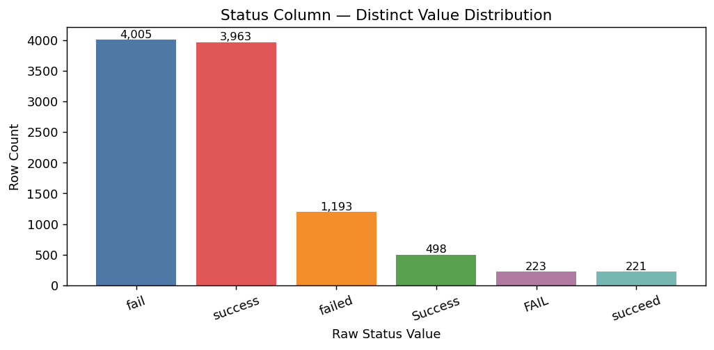
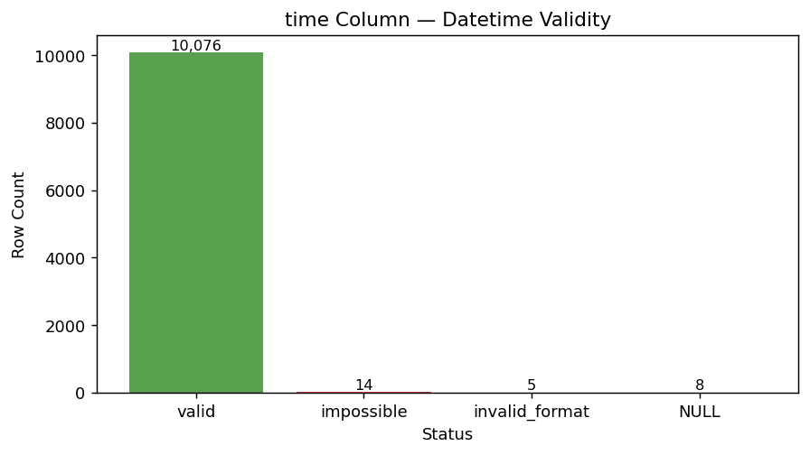
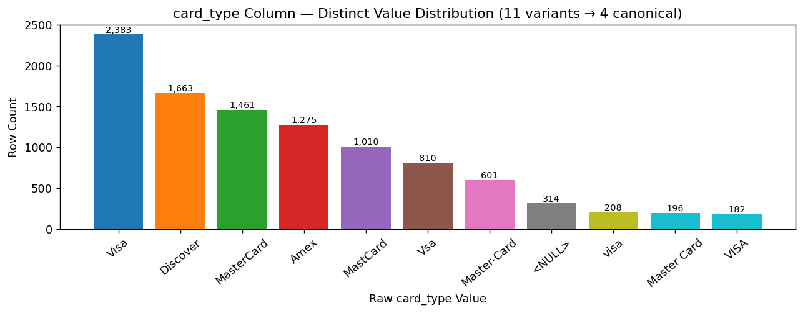
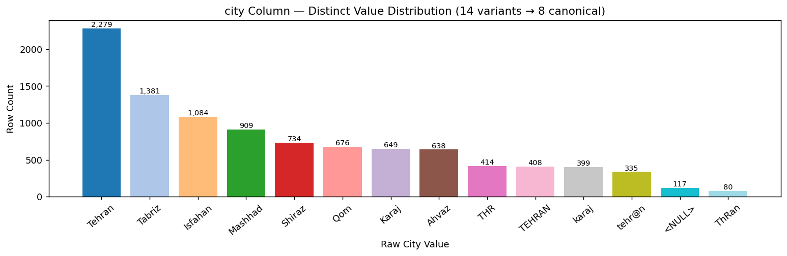
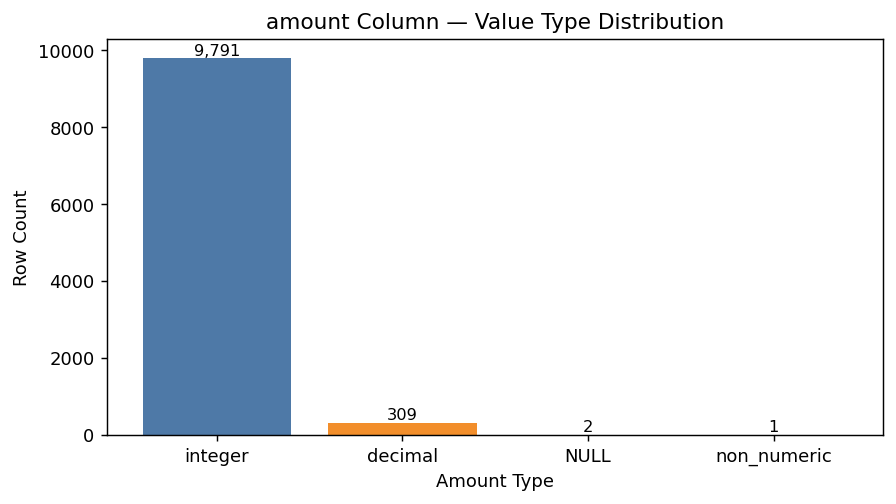
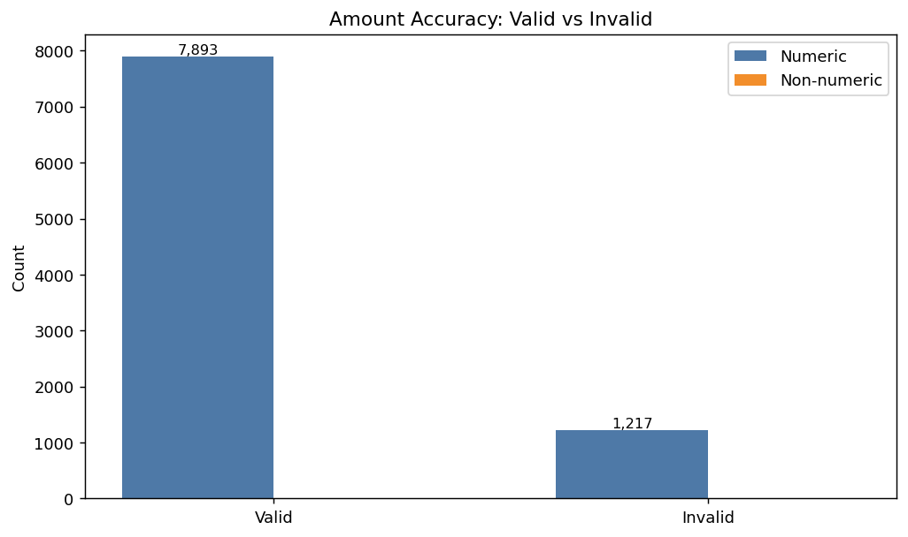
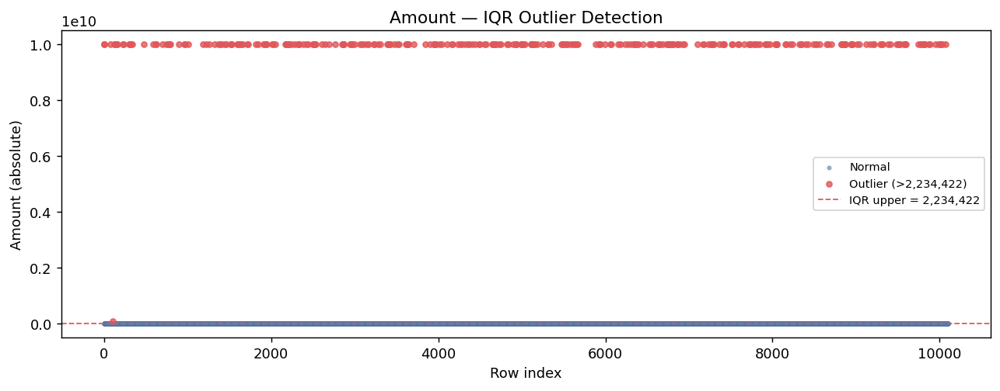
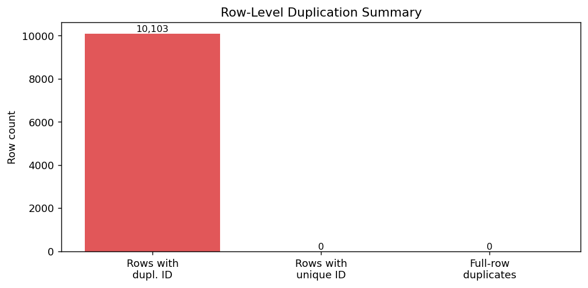
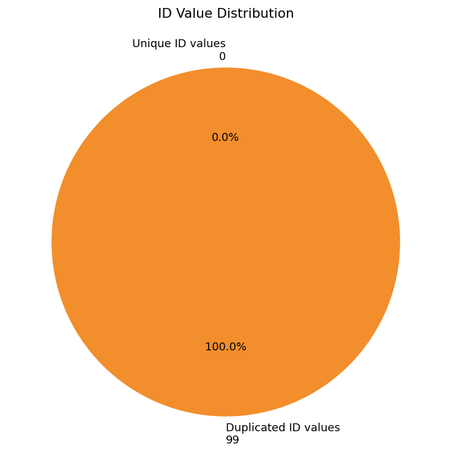
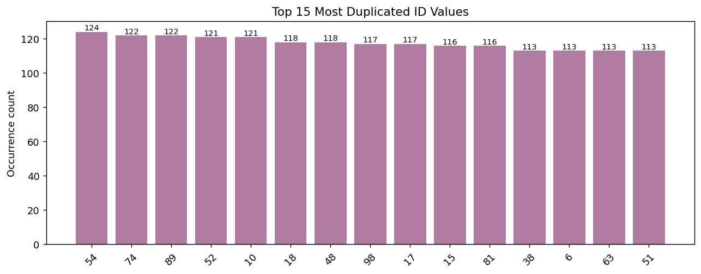

# Consistency Analysis Report

**Dataset:** `transaction.csv` | **Rows:** 10,103 | **Columns:** 6 (`id`, `status`, `time`, `card_type`, `city`, `amount`)

---

## 1. Introduction

Consistency in data quality refers to whether values conform to a defined, uniform standard — including consistent formatting, naming conventions, value domains, and data types. This report profiles `transaction.csv` across all columns to identify inconsistencies, quantify their impact, and justify the need for data re-engineering.

---

## 2. Column-by-Column Consistency Findings

### 2.1 `status` Column

The `status` column is expected to hold exactly two distinct logical values: **success** and **failed**. Profiling revealed **6 distinct raw values** across 10,103 rows, caused by inconsistent casing and alternate spellings.

| Raw Value | Row Count | % of Total | Logical Meaning |
|-----------|----------:|------------|-----------------|
| `fail`    | 4,005     | 39.64%     | failed          |
| `success` | 3,963     | 39.23%     | success         |
| `failed`  | 1,193     | 11.81%     | failed          |
| `Success` | 498       | 4.93%      | success         |
| `FAIL`    | 223       | 2.21%      | failed          |
| `succeed` | 221       | 2.19%      | success         |

**Issues identified:**
- **Case inconsistency:** `success`/`Success` and `fail`/`FAIL` represent the same value but differ in capitalisation.
- **Synonym inconsistency:** `succeed` and `fail`/`failed` are alternate terms for the same outcome — no single canonical form is enforced.
- **Impact:** 2,135 rows (21.13%) use a non-standard form. Any grouping or filtering on `status` without normalisation produces incorrect results.

**Justification for re-engineering:** Standardise all values to `success` | `failed` using case-insensitive mapping (`succeed` → `success`, `fail`/`FAIL` → `failed`).

---

### 2.2 `time` Column

The `time` column is expected to hold a consistent datetime format. Profiling revealed **two competing formats in active use**, plus invalid and malformed entries.

| Format / Status | Count | % of Total |
|----------------|------:|------------|
| `YYYY-MM-DD HH:MM:SS` (primary valid format) | 10,000 | 99.0% of valid |
| `HH:MM YYYY-MM-DD` (alternate valid format) | 76 | 0.75% |
| Impossible datetime (e.g. `99:99 2025-13-40`, `25:61 2025-09-11`) | 14 | 0.14% |
| Other invalid format (e.g. `3pm 2025/09/11`, `03-00-2025 09-11`) | 5 | 0.05% |
| NULL / missing | 8 | 0.08% |

**Issues identified:**
- **Dual format inconsistency:** 76 rows use `HH:MM YYYY-MM-DD` alongside the primary `YYYY-MM-DD HH:MM:SS` format. While parseable, mixed formats break any pipeline expecting a single format.
- **Impossible datetime values:** 14 rows contain logically impossible values (hour `99`, minute `61`, month `13`). These pass a string check but fail calendar validation.
- **Non-standard formats:** 5 rows use formats such as `3pm 2025/09/11` or `03-00-2025 09-11` — unrecognised by standard datetime parsers.
- **Impact:** 103 rows (1.02%) are either inconsistently formatted or invalid. Mixed formats cause silent parsing failures in downstream analysis.

**Justification for re-engineering:** Normalise all valid datetimes to a single canonical format `YYYY-MM-DD HH:MM:SS`. Impossible dates and unresolvable formats are set to NULL.

---

### 2.3 `card_type` Column

The `card_type` column is expected to hold one of four standard card brands: **Visa, MasterCard, Amex, Discover**. Profiling revealed **11 distinct raw values** caused by typos, abbreviations, and casing differences.

| Raw Value      | Row Count | % of Total | Correct Form |
|---------------|----------:|------------|--------------|
| `Visa`        | 2,383     | 23.59%     | Visa         |
| `Discover`    | 1,663     | 16.46%     | Discover     |
| `MasterCard`  | 1,461     | 14.46%     | MasterCard   |
| `Amex`        | 1,275     | 12.62%     | Amex         |
| `MastCard`    | 1,010     | 10.00%     | MasterCard   |
| `Vsa`         | 810       | 8.02%      | Visa         |
| `Master-Card` | 601       | 5.95%      | MasterCard   |
| `<NULL>`      | 314       | 3.11%      | —            |
| `visa`        | 208       | 2.06%      | Visa         |
| `Master Card` | 196       | 1.94%      | MasterCard   |
| `VISA`        | 182       | 1.80%      | Visa         |

**Issues identified:**
- **Typographical errors:** `MastCard` (1,010 rows) and `Vsa` (810 rows) are misspellings of standard card brands.
- **Format inconsistency:** `Master-Card`, `Master Card`, and `MasterCard` are three representations of the same brand.
- **Case inconsistency:** `Visa`, `visa`, `VISA` are identical in meaning but differ in casing.
- **Impact:** 3,007 rows (29.77%) carry a non-standard or misspelled card type value. Aggregation by card brand without standardisation severely misrepresents transaction volumes per brand.

**Justification for re-engineering:** Map all variants to four canonical values: `Visa`, `MasterCard`, `Amex`, `Discover`. NULL values (314 rows) retained as `Unknown`.

---

### 2.4 `city` Column

The `city` column is expected to represent one of eight known cities. Profiling revealed **14 distinct raw values** for only 8 logical cities.

| Raw Value  | Row Count | % of Total | Correct Form |
|-----------|----------:|------------|--------------|
| `Tehran`  | 2,279     | 22.56%     | Tehran       |
| `Tabriz`  | 1,381     | 13.67%     | Tabriz       |
| `Isfahan` | 1,084     | 10.73%     | Isfahan      |
| `Mashhad` | 909       | 9.00%      | Mashhad      |
| `Shiraz`  | 734       | 7.27%      | Shiraz       |
| `Qom`     | 676       | 6.69%      | Qom          |
| `Karaj`   | 649       | 6.42%      | Karaj        |
| `Ahvaz`   | 638       | 6.31%      | Ahvaz        |
| `THR`     | 414       | 4.10%      | Tehran       |
| `TEHRAN`  | 408       | 4.04%      | Tehran       |
| `karaj`   | 399       | 3.95%      | Karaj        |
| `tehr@n`  | 335       | 3.32%      | Tehran       |
| `<NULL>`  | 117       | 1.16%      | —            |
| `ThRan`   | 80        | 0.79%      | Tehran       |

**Issues identified:**
- **Abbreviation inconsistency:** `THR` (414 rows) is the IATA airport code for Tehran used in place of the full city name.
- **Case inconsistency:** `TEHRAN`, `Tehran`, `karaj`/`Karaj`, `ThRan` refer to the same cities with different capitalisation.
- **Data entry error:** `tehr@n` (335 rows) is a typo where `@` replaces `a` — likely a keyboard or input sanitisation error.
- **Impact:** 1,636 rows (16.19%) carry a non-standard city value. Tehran alone is fragmented across 5 variants (3,516 rows total), appearing as 5 separate cities without normalisation.

**Justification for re-engineering:** Map all variants to 8 canonical city names using case-insensitive matching. Handle `tehr@n` as a pattern substitution. NULL values filled as `Unknown`.

---

### 2.5 `amount` Column

The `amount` column is expected to hold consistent positive numeric values. Profiling revealed a **mixed-type column** with integers, decimals, non-numeric text, and negative values.

| Type / Status | Row Count | % of Total |
|--------------|----------:|------------|
| Integer      | 9,791     | 96.91%     |
| Decimal      | 309       | 3.06%      |
| NULL         | 2         | 0.02%      |
| Non-numeric (`one hundred`) | 1 | 0.01% |

Additionally from accuracy profiling:
- **1,217 rows** contain negative amounts (e.g. `-5000`, `-999999`) — transactions cannot carry negative monetary values.
- **1 row** contains the string `"one hundred"` instead of the numeric value `100`.

**Issues identified:**
- **Type inconsistency:** Mixing integers (96.91%) and decimals (3.06%) in the same numeric column is inconsistent. If the column is intended to represent Iranian Rial amounts, decimal entries such as `100.50` are anomalous.
- **Semantic inconsistency:** 1,217 rows (12.05%) contain negative amounts, violating the business rule that transaction amounts must be positive.
- **Encoding inconsistency:** `"one hundred"` is a natural language representation of a numeric value — inconsistent with all other entries.

**Justification for re-engineering:** Convert all amounts to absolute values (negatives treated as data entry sign errors), parse `"one hundred"` → `100`, standardise type to `double/float`. Flag and null IQR outliers (e.g. `9,999,999,999`).

---

### 2.6 `id` Column

The `id` column is expected to uniquely identify each transaction. Profiling revealed **100% duplication** across all 10,103 rows.

| Metric | Value |
|--------|------:|
| Total rows | 10,103 |
| Rows with duplicated ID | 10,103 (100%) |
| Unique ID values | 99 |
| Most duplicated ID (`54`) | 124 occurrences |

**Issues identified:**
- **Identity inconsistency:** Only 99 distinct values exist across 10,103 rows. The `id` column functions as a repeated reference code, not a transaction identifier.
- **No exact row duplicates:** Despite ID duplication, no two rows are identical across all columns — confirming these are distinct transactions sharing a non-unique ID.
- **Impact:** Any join, lookup, or deduplication using `id` as a primary key produces incorrect results.

**Justification for re-engineering:** Assign a new surrogate transaction identifier (`TRX_00001` through `TRX_10103`) to guarantee uniqueness. Preserve the original `id` field for reference.

---

## 3. Consistency Summary

| Column     | Inconsistent Rows | % Affected | Primary Issue |
|------------|------------------:|------------|---------------|
| `status`   | 2,135             | 21.13%     | Mixed casing, synonyms |
| `time`     | 103               | 1.02%      | Dual formats, impossible dates |
| `card_type`| 3,007             | 29.77%     | Typos, casing, abbreviations |
| `city`     | 1,636             | 16.19%     | Casing, abbreviations, typos |
| `amount`   | 1,218             | 12.06%     | Negative values, non-numeric text, mixed types |
| `id`       | 10,103            | 100.00%    | Non-unique identifier |

5 out of 6 columns exhibit significant consistency violations. The dataset cannot be reliably used for analysis, reporting, or integration without re-engineering.

---

## 4. Justification for Data Re-engineering

The consistency profiling above provides direct, evidence-based justification for each re-engineering action:

1. **Status standardisation** — 21.13% of rows use non-canonical status labels. Grouping by outcome is impossible without normalisation.
2. **Datetime normalisation** — Two active formats and 19 invalid or impossible datetime entries break automated parsing and time-series analysis.
3. **Card type canonicalisation** — Nearly 30% of card type values are misspelled or inconsistently formatted. Brand-level transaction analysis requires a clean domain.
4. **City canonicalisation** — Tehran alone is split across 5 variants totalling 3,516 rows. Geographic analysis is entirely unreliable without mapping.
5. **Amount type enforcement** — Negative values (12.05%) and non-numeric entries violate the numeric contract of a financial column. Type and sign must be enforced.
6. **Surrogate key generation** — The original `id` has zero uniqueness guarantee. A proper primary key is required for any relational or analytical operation.

---

## 5. Conclusion

This consistency analysis demonstrates that `transaction.csv` contains systematic, multi-column inconsistencies arising from data entry errors, format ambiguities, and the absence of input validation. The issues are not isolated — they affect all six columns and collectively impact a significant proportion of the 10,103 rows. The evidence gathered through profiling directly supports and necessitates the data re-engineering pipeline implemented in `transaction_reengineering.py`.
